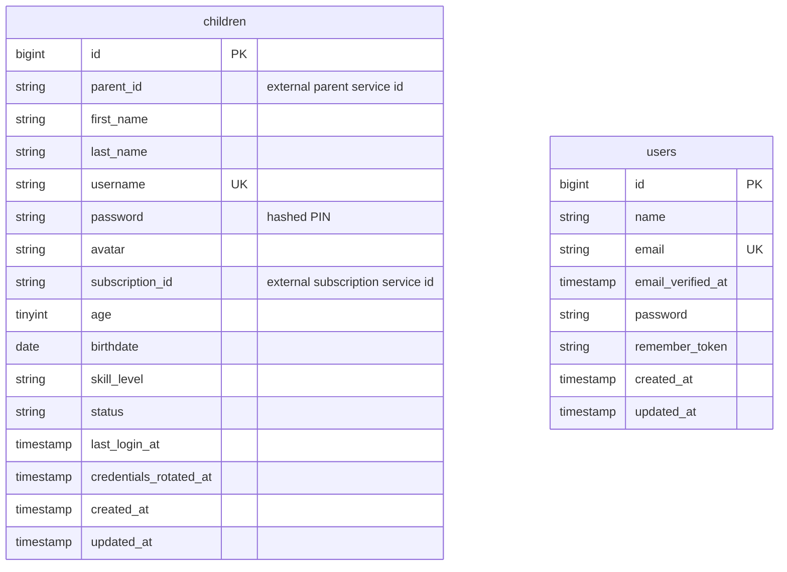

# Database Schema

This service uses Laravel migrations as the source of truth for its database schema.
The default connection is SQLite (`DB_CONNECTION=sqlite`), with standard Laravel
connection options also available for MySQL, MariaDB, PostgreSQL, and SQL Server.

## Data Ownership

The service owns child profiles, child login credentials, and child-scoped
authentication state.

It does not own parent users, households, billing, or subscription records. Those
relationships are represented with external ids:

| Field | Table | Meaning |
| --- | --- | --- |
| `parent_id` | `children` | External parent or household owner id from the parent service. |
| `subscription_id` | `children` | Optional external subscription id from the subscription service. |

There are currently no database-level foreign keys to other services.

## Entity Relationship Overview

`children` is the domain table. The remaining tables are Laravel infrastructure
for framework auth scaffolding, sessions, cache, queues, batches, and failed jobs.

## `children`

Created by `2026_03_16_171823_create_children_table.php`.

| Column | Type | Nullable | Default | Indexes | Notes |
| --- | --- | --- | --- | --- | --- |
| `id` | unsigned bigint | No | auto-increment | Primary key | Internal child account id. |
| `parent_id` | string | No | none | Index | External parent id from the parent service. Every parent-owned query is scoped by this value. |
| `first_name` | string | No | none | none | Required display/profile name. API validation limits this to 100 characters. |
| `last_name` | string | Yes | `null` | none | Optional display/profile name. API validation limits this to 100 characters. |
| `username` | string | No | none | Unique | Generated child login username. Created from the child's name plus a random suffix. |
| `password` | string | No | none | none | Hashed child PIN. The plain PIN is only returned on create or credential reset. |
| `avatar` | string | Yes | `null` | none | Optional avatar URL or avatar identifier. API validation limits this to 2048 characters. |
| `subscription_id` | string | Yes | `null` | none | Optional external subscription id. API validation limits this to 100 characters. |
| `age` | unsigned tinyint | Yes | `null` | none | Optional age. API validation allows 1 through 18. |
| `birthdate` | date | Yes | `null` | none | Optional birth date. Cast to a Laravel date in `App\Models\Child`. |
| `skill_level` | string | Yes | `null` | none | Optional reading or learning level. API validation limits this to 50 characters. |
| `status` | string | No | `active` | Index | Account state. API currently allows `active` and `suspended`; only active children can log in. |
| `last_login_at` | timestamp | Yes | `null` | none | Updated after successful child login. Cast to a Laravel datetime. |
| `credentials_rotated_at` | timestamp | Yes | `null` | none | Set when credentials are generated or reset. Cast to a Laravel datetime. |
| `created_at` | timestamp | Yes | `null` | none | Laravel-managed creation timestamp. |
| `updated_at` | timestamp | Yes | `null` | none | Laravel-managed update timestamp. |

### `children` Behavior

- `parent_id` is read from the parent JWT claim (`sub` or `parent_id`) and is
  used for parent-level authorization.
- `username` is globally unique, not unique per parent.
- Assigning `password` through the `Child` model hashes the value before storage.
- Child records are deleted with a normal Eloquent delete; the table does not use
  soft deletes.
- `status = suspended` prevents child login and causes child-token profile
  requests to fail the active-account check.

## Laravel Auth Tables

Created by `0001_01_01_000000_create_users_table.php`.

### `users`

| Column | Type | Nullable | Default | Indexes | Notes |
| --- | --- | --- | --- | --- | --- |
| `id` | unsigned bigint | No | auto-increment | Primary key | Standard Laravel user id. Not used for parent ownership in this service. |
| `name` | string | No | none | none | User display name. |
| `email` | string | No | none | Unique | User email address. |
| `email_verified_at` | timestamp | Yes | `null` | none | Email verification timestamp. |
| `password` | string | No | none | none | Hashed user password. |
| `remember_token` | string | Yes | `null` | none | Laravel remember-me token. |
| `created_at` | timestamp | Yes | `null` | none | Laravel-managed creation timestamp. |
| `updated_at` | timestamp | Yes | `null` | none | Laravel-managed update timestamp. |

### `password_reset_tokens`

| Column | Type | Nullable | Default | Indexes | Notes |
| --- | --- | --- | --- | --- | --- |
| `email` | string | No | none | Primary key | Email address requesting a reset. |
| `token` | string | No | none | none | Password reset token. |
| `created_at` | timestamp | Yes | `null` | none | Token creation timestamp. |

### `sessions`

| Column | Type | Nullable | Default | Indexes | Notes |
| --- | --- | --- | --- | --- | --- |
| `id` | string | No | none | Primary key | Laravel session id. |
| `user_id` | unsigned bigint | Yes | `null` | Index | Optional Laravel user id. No foreign key constraint is declared. |
| `ip_address` | string(45) | Yes | `null` | none | Client IP address. |
| `user_agent` | text | Yes | `null` | none | Client user agent string. |
| `payload` | long text | No | none | none | Serialized session payload. |
| `last_activity` | integer | No | none | Index | Unix timestamp used for session cleanup. |

## Cache Tables

Created by `0001_01_01_000001_create_cache_table.php`.

### `cache`

| Column | Type | Nullable | Default | Indexes | Notes |
| --- | --- | --- | --- | --- | --- |
| `key` | string | No | none | Primary key | Cache key. |
| `value` | medium text | No | none | none | Serialized cache value. |
| `expiration` | integer | No | none | Index | Expiration timestamp. |

### `cache_locks`

| Column | Type | Nullable | Default | Indexes | Notes |
| --- | --- | --- | --- | --- | --- |
| `key` | string | No | none | Primary key | Lock key. |
| `owner` | string | No | none | none | Lock owner token. |
| `expiration` | integer | No | none | Index | Expiration timestamp. |

## Queue Tables

Created by `0001_01_01_000002_create_jobs_table.php`.

### `jobs`

| Column | Type | Nullable | Default | Indexes | Notes |
| --- | --- | --- | --- | --- | --- |
| `id` | unsigned bigint | No | auto-increment | Primary key | Queued job id. |
| `queue` | string | No | none | Index | Queue name. |
| `payload` | long text | No | none | none | Serialized job payload. |
| `attempts` | unsigned tinyint | No | none | none | Number of processing attempts. |
| `reserved_at` | unsigned integer | Yes | `null` | none | Reservation timestamp. |
| `available_at` | unsigned integer | No | none | none | Earliest processing timestamp. |
| `created_at` | unsigned integer | No | none | none | Creation timestamp. |

### `job_batches`

| Column | Type | Nullable | Default | Indexes | Notes |
| --- | --- | --- | --- | --- | --- |
| `id` | string | No | none | Primary key | Batch id. |
| `name` | string | No | none | none | Batch name. |
| `total_jobs` | integer | No | none | none | Total jobs in the batch. |
| `pending_jobs` | integer | No | none | none | Jobs not yet completed. |
| `failed_jobs` | integer | No | none | none | Number of failed jobs. |
| `failed_job_ids` | long text | No | none | none | Serialized ids of failed jobs. |
| `options` | medium text | Yes | `null` | none | Serialized batch options. |
| `cancelled_at` | integer | Yes | `null` | none | Cancellation timestamp. |
| `created_at` | integer | No | none | none | Creation timestamp. |
| `finished_at` | integer | Yes | `null` | none | Completion timestamp. |

### `failed_jobs`

| Column | Type | Nullable | Default | Indexes | Notes |
| --- | --- | --- | --- | --- | --- |
| `id` | unsigned bigint | No | auto-increment | Primary key | Failed job id. |
| `uuid` | string | No | none | Unique | Failed job UUID. |
| `connection` | text | No | none | none | Queue connection name. |
| `queue` | text | No | none | none | Queue name. |
| `payload` | long text | No | none | none | Serialized job payload. |
| `exception` | long text | No | none | none | Serialized exception details. |
| `failed_at` | timestamp | No | current timestamp | none | Failure timestamp. |

## Migration Metadata

Laravel also creates and manages a `migrations` table when migrations run. It is
configured in `config/database.php` and records which migrations have already
been applied.

## Operational Notes

- Run migrations with `php artisan migrate`.
- For local SQLite development, ensure `database/database.sqlite` exists before
  migrating.
- The schema has no explicit cascading relationships today. Deleting a child does
  not cascade to any other service-owned data.
- If the service later needs per-parent username reuse, the `children.username`
  unique index would need to become a composite unique index with `parent_id`.
